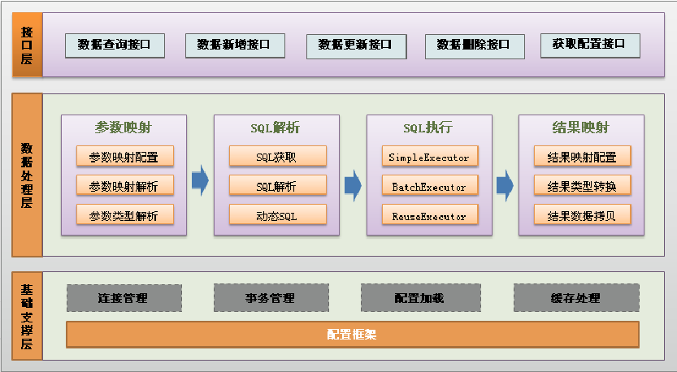
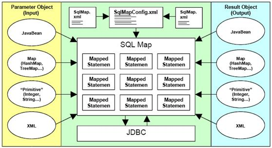

# ORM

ORM 

## 含义

对象关系映射,用来描述对象和表之间的映射关系。

## 示意图

- 类名<---------------------------->表名
- 对象<---------------------------->一条记录
- 属性<---------------------------->列名

# mybatis

## 简介

MyBatis 是支持普通 SQL 操作,存储过程和高级映射的优秀持久层框架。MyBatis 消除 了几乎所有的 传统JDBC 代码和参数的手工设置以及结果集的封装操作。可以使用 XML 或注解用于配置和原始映射,将接口和 Java 的 POJO(Plan Old Java Object,普通的 Java 对象)映射成数据库中的记录。

MyBatis的前身是iBatis，MyBatis在iBatis的基础上面，对代码结构进行了大量的重构和简化 【包名依然ibatis】

每一个MyBatis的应用程序都以一个SqlSessionFactory对象的实例为核心

## 相关概念

- 主配置文件
  - 数据库连接信息
  - 指定映射文件路径
  - 等等
- 映射文件
  - 存放SQL语句
  - 一般一张主表对应一个映射文件  

## 相关类或接口

- SqlSessionFactoryBuilder **【用来构建SqlSessionFactory】**
  - build(InputStream inputStream)

    > 该方法返回SqlSessionFactory对象

- SqlSessionFactory **【理解为DataSource,用来获取SqlSession】**
  - openSession()

    > 该方法返回SqlSession对象

- SqlSession **【理解为Connection,用来发送SQL语句】**
  - close

    > 关闭

  - commit

    > 事务提交

## 开发步骤

- 添加依赖

  ```xml
  <!--  mybatis依赖-->
  <dependency>
      <groupId>org.mybatis</groupId>
      <artifactId>mybatis</artifactId>
      <version>3.4.5</version>
  </dependency>

  <dependency>
      <groupId>mysql</groupId>
      <artifactId>mysql-connector-java</artifactId>
      <version>8.0.33</version>
      <scope>runtime</scope>
  </dependency>
  ```

- 编写配置文件
  - 一个主配置文件
    - 数据库的链接信息
    - 指定映射文件路径
    - 等等
  - N个映射文件

- 编写代码
  - SqlSessionFactoryBuilder
    - SqlSessionFactory
      - SqlSession
        - selectList
        - close
        - commit
        - 等等

# 入门案例*

## 代码

user表

```sql
/*
 Navicat Premium Data Transfer

 Source Server         : localhost
 Source Server Type    : MySQL
 Source Server Version : 80028
 Source Host           : localhost:3306
 Source Schema         : mybatis

 Target Server Type    : MySQL
 Target Server Version : 80028
 File Encoding         : 65001

 Date: 22/06/2026 16:28:42
*/

SET NAMES utf8mb4;
SET FOREIGN_KEY_CHECKS = 0;

-- ----------------------------
-- Table structure for user
-- ----------------------------
DROP TABLE IF EXISTS `user`;
CREATE TABLE `user`  (
  `id` bigint NOT NULL AUTO_INCREMENT,
  `name` varchar(40) CHARACTER SET utf8mb4 COLLATE utf8mb4_0900_ai_ci NOT NULL,
  `address` varchar(100) CHARACTER SET utf8mb4 COLLATE utf8mb4_0900_ai_ci NULL DEFAULT NULL,
  PRIMARY KEY (`id`) USING BTREE
) ENGINE = InnoDB CHARACTER SET = utf8mb4 COLLATE = utf8mb4_0900_ai_ci ROW_FORMAT = Dynamic;

-- ----------------------------
-- Records of user
-- ----------------------------
INSERT INTO `user` VALUES (1, 'zs', '广西桂林');
INSERT INTO `user` VALUES (2, 'lisi', '广西南宁');

SET FOREIGN_KEY_CHECKS = 1;

```


UserVO.java

```java
public class UserVO {

    private Integer id;
    private String name;
    private Integer money;

    public Integer getId() {
        return id;
    }

    public void setId(Integer id) {
        this.id = id;
    }

    public String getName() {
        return name;
    }

    public void setName(String name) {
        this.name = name;
    }

    public Integer getMoney() {
        return money;
    }

    public void setMoney(Integer money) {
        this.money = money;
    }

    @Override
    public String toString() {
        return "UserVO{" +
                "id=" + id +
                ", name='" + name + '\'' +
                ", money=" + money +
                '}';
    }
}
```

mybatis.xml

```xml
<?xml version="1.0" encoding="UTF-8" ?>
<!DOCTYPE configuration
        PUBLIC "-//mybatis.org//DTD Config 3.0//EN"
        "http://mybatis.org/dtd/mybatis-3-config.dtd">
<configuration>
    <environments default="development">
        <environment id="development">
            <transactionManager type="JDBC"/>
            <dataSource type="POOLED">
                <property name="driver" value="com.mysql.cj.jdbc.Driver"/>
                <property name="url" value="jdbc:mysql://localhost:3306/bbs"/>
                <property name="username" value="root"/>
                <property name="password" value="root"/>
            </dataSource>
        </environment>
    </environments>

    <mappers>
        <mapper resource="./UserMapper.xml"/>
    </mappers>
</configuration>
```

UserMapper.xml

```xml
<?xml version="1.0" encoding="UTF-8" ?>
<!DOCTYPE mapper
        PUBLIC "-//mybatis.org//DTD Mapper 3.0//EN"
        "http://mybatis.org/dtd/mybatis-3-mapper.dtd">


<!--namespace:命名空间-->
<mapper namespace="com.neu.mapper.UserMapper">

    <!--  id:唯一的标识   resultType:表中一条记录封装成什么类型的对象-->
    <select id="findAll" resultType="com.neu.day01.vo.UserVO">
        select id,name,address from user
    </select>
</mapper>
```

UserVO.java

```java
public class UserVO {

    private String name;
    private String address;

    public String getName() {
        return name;
    }

    public void setName(String name) {
        this.name = name;
    }

    public String getAddress() {
        return address;
    }

    public void setAddress(String address) {
        this.address = address;
    }

    @Override
    public String toString() {
        return "UserVO{" +
                "name='" + name + '\'' +
                ", address='" + address + '\'' +
                '}';
    }
}
```

HelloWorld.java

```java
public class HelloWorld {
    public static void main(String[] args) throws IOException {

        SqlSessionFactoryBuilder sqlSessionFactoryBuilder = new SqlSessionFactoryBuilder();

        InputStream inputStream =  Resources.getResourceAsStream("mybatis.xml");
        SqlSessionFactory sqlSessionFactory =  sqlSessionFactoryBuilder.build(inputStream);


        SqlSession session = sqlSessionFactory.openSession();  //理解为Connection

        //执行SQL语句
        List<UserVO> userVOList = session.selectList("com.neu.mapper.UserMapper.findAll");

        for(UserVO userVO : userVOList){
            System.out.println(userVO);
        }
        session.close();
    }
}
```


# 架构

## 示意图



## 描述

- API接口层

  提供给外部使用的接口API，开发人员通过这些本地API来操纵数据库。接口层一接收到调用请求就会调用数据处理层来完成具体的数据处理。

- 数据处理层

  负责具体的SQL查找、SQL解析、SQL执行和执行结果映射处理等。它主要的目的是根据调用的请求完成一次数据库操作。

- 基础支撑层

  负责最基础的功能支撑，包括连接管理、事务管理、配置加载和缓存处理，这些都是共用的东西，将他们抽取出来作为最基础的组件。为上层的数据处理层提供最基础的支撑。

# 内部执行

## 示意图



## 文字描述

- 加载配置并初始化
  将SQL的配置信息加载成为一个个MappedStatement对象（包括了传入参数映射配置、执行的SQL语句、结果映射配置），存储在内存中
- 接收调用请求
  传入参数为SQL的ID和传入参数对象
- 处理操作请求,处理过程如下:
  - 根据SQL的ID查找对应的MappedStatement对象。
  - 根据传入参数对象解析MappedStatement对象，得到最终要执行的SQL和执行传入参数。
  - 获取数据库连接，根据得到的最终SQL语句和执行传入参数到数据库执行，并得到执行结果。
  - 根据MappedStatement对象中的结果映射配置对得到的执行结果进行转换处理，并得到最终的处理结果。
  - 释放连接资源。
- 返回处理结果
  将最终的处理结果返回。

# 主配置文件

- properties

  ```properties
  <properties resource="指定配置文件名.properties"
     <property name="名字" value="具体值"/>
     <property name="名字N" value="具体值N"/>
  ```

  > 优先加载property,然后加载配置文件中的,如果有相同的名字会被覆盖。

- settings 设置

  > 以后学习

- typeAliases类型命名

  > 用来配置别名的

  ```xml
  <typeAliases>
      <!--这种方式是一个一个设置别名-->
      <!--
      <typeAlias type="com.neu.vo.UserVO" alias="userVO"></typeAlias>
      -->
  
    <!--给指定包下的所有类设置别名,此时就会给指定包下的类生成对应的别名【比如:生成userVO和UserVO】-->
      <package name="com.neu.vo"/>
  </typeAliases>
  ```
  
  > 内置别名
>
  > | 别名       | 映射的类型 |
  > | :--------- | :--------- |
  > | \_byte     | byte       |
  > | \_long     | long       |
  > | \_short    | short      |
  > | \_int      | int        |
  > | \_integer  | int        |
  > | \_double   | double     |
  > | \_float    | float      |
  > | \_boolean  | boolean    |
  > | string     | String     |
  > | byte       | Byte       |
  > | long       | Long       |
  > | short      | Short      |
  > | int        | Integer    |
  > | integer    | Integer    |
  > | double     | Double     |
  > | float      | Float      |
  > | boolean    | Boolean    |
  > | date       | Date       |
  > | decimal    | BigDecimal |
  > | bigdecimal | BigDecimal |
  > | object     | Object     |
  > | map        | Map        |
  > | hashmap    | HashMap    |
  > | list       | List       |
  > | arraylist  | ArrayList  |
  > | collection | Collection |
  > | iterator   | Iterator   |

- typeHandlers

  > 类型处理器,内置的已经满足要求,不需要自定义

- plugins

  > 插件,比如可以使用分页插件

- environments

  > 表示环境,spring整合后 environments配置将废除
  - transactionManager【MyBatis中有两种事务管理器类型】
    - JDBC：使用了JDBC的提交和回滚设置。
    - MANAGED(托管)：而它让容器来管理事务的整个生命周期（比如spring、jee应用服务器的上下文）
  - dataSource 【用来配置基本的JDBC数据源连接信息】
    - UNPOOLED 不使用连接池
    - POOLED 使用内置的连接池

```xml
  <!--default用来指定使用哪个环境-->
  <environments default="development">
      <!--开发环境-->
      <environment id="development">

          <transactionManager type="JDBC"/>
          <dataSource type="POOLED">
               <property name="driver" value="${driver}"/>
               <property name="url" value="${url}"/>
               <property name="username" value="${username}"/>
               <property name="password" value="${password}"/>
          </dataSource>
      </environment>

      <!--生产环境-->
      <environment id="product">
          <transactionManager type="JDBC"/>
          <dataSource type="POOLED">
               <property name="driver" value="${driver}"/>
               <property name="url" value="${url}"/>
               <property name="username" value="${username}"/>
               <property name="password" value="${password}"/>
          </dataSource>
      </environment>

  </environments>
```

- mappers

  > 映射器,用来指定映射文件的

  ```xml
  <mapper resource="映射文件路径"></mapper>
  ```

## 案例


mybatis.xml

```xml
<?xml version="1.0" encoding="UTF-8" ?>
<!DOCTYPE configuration
        PUBLIC "-//mybatis.org//DTD Config 3.0//EN"
        "http://mybatis.org/dtd/mybatis-3-config.dtd">
<configuration>

    <properties resource="db.properties"/>

    <typeAliases>
        <!--一个一个设置别名-->
        <!--
        <typeAlias type="com.neu.vo.UserVO" alias="userVO"></typeAlias>
        -->

        <!--给指定包下的所有类设置别名,此时就会给指定包下的类生成对应的别名【userVO UserVO】-->
        <package name="com.neu.vo"/>
    </typeAliases>

    <environments default="development">
        <!--代表开发环境-->
        <environment id="development">
            <transactionManager type="JDBC"/>
            <dataSource type="POOLED">
                <property name="driver" value="${driver}"/>
                <property name="url" value="${url}"/>
                <property name="username" value="${username}"/>
                <property name="password" value="${password}"/>
            </dataSource>
        </environment>

        <!--代表生产环境-->
        <environment id="product">
            <transactionManager type="JDBC"/>
            <dataSource type="POOLED">
                <property name="driver" value="${driver}"/>
                <property name="url" value="${url}"/>
                <property name="username" value="${username}"/>
                <property name="password" value="${password}"/>
            </dataSource>
        </environment>
    </environments>

    <!--指定映射文件的路径-->
    <mappers>
        <mapper resource="UserMapper.xml"/>
    </mappers>
</configuration>
```

# 代理curd*

## 抛出问题

- sql的Id容易写错
- 参数个数和参数的类型容易写错
- 接收返回类型容易写错

## 好处

使用代理方式可以避免上面的问题

## 约定

- 编写一个接口
- 接口的全限定名要和对应映射文件的中的namespace一样
- 接口中方法名称要和对应映射文件中的id一样
- 接中方法的参数信息要和对应映射文件中的对应id的参数类型一样
- 接中方法的返回类型要和对应映射文件中的对应id的返回类型一样

## 方法

- sqlSession.getMapper(Mapper接口.class)

  > 该方法会产生一个代理对象,该代理对象实现Mapper接口

## 案例

User.java

```java
public class User {

    private Integer id;
    private String name;
    private String address;

    public Integer getId() {
        return id;
    }

    public void setId(Integer id) {
        this.id = id;
    }

    public String getName() {
        return name;
    }

    public void setName(String name) {
        this.name = name;
    }

    public String getAddress() {
        return address;
    }

    public void setAddress(String address) {
        this.address = address;
    }
}

```

UserVO.java

```java
public class UserVO {

    private int id;
    private String name;
    private String address;

    public int getId() {
        return id;
    }

    public void setId(int id) {
        this.id = id;
    }

    public String getName() {
        return name;
    }

    public void setName(String name) {
        this.name = name;
    }

    public String getAddress() {
        return address;
    }

    public void setAddress(String address) {
        this.address = address;
    }

    @Override
    public String toString() {
        return "UserVO{" +
                "id=" + id +
                ", name='" + name + '\'' +
                ", address='" + address + '\'' +
                '}';
    }
}

```

UserMapper.java

```java
public interface UserMapper {
    List<UserVO> findAll();

    UserVO findById(int id);


    //返回的int代表所影响的记录数
    int add(User user);

    int updateById(User user);

    int deleteById(int id);
}
```

UserMapper.xml

```xml
<?xml version="1.0" encoding="UTF-8" ?>
<!DOCTYPE mapper
        PUBLIC "-//mybatis.org//DTD Mapper 3.0//EN"
        "http://mybatis.org/dtd/mybatis-3-mapper.dtd">

<mapper namespace="com.neu.mapper.UserMapper">

    <select id="findAll" resultType="userVO">
        select id,name,address from user
    </select>


    <!--    resultType:一行记录封装成什么类型的对象-->
    <!-- 参数获取  #{参数属性}
       如果是8大基本数据类型，因为没有属性，所以参数属性可以随便写
       -->
    <select id="findById" resultType="userVO">
        select id,name,address from user where id = #{xxxx}
    </select>

    <!--parameterType 参数的类型，可以写也可以不写-->
    <insert id="add" parameterType="user">
        insert into user(name,address) values(#{name},#{address})
    </insert>

    <update id="updateById" parameterType="user">
        update user set address = #{address} where id = #{id}
    </update>


    <delete id="deleteById" parameterType="int">
        delete from user where id = #{id}
    </delete>

</mapper>
```

SqlSessionUtil.java

```java
public class SqlSessionUtil {

    private static SqlSessionFactory sqlSessionFactory;

    static {
        //SqlSessionFactoryBuilder-->SqlSessionFactory-->SqlSession
        SqlSessionFactoryBuilder builder = new SqlSessionFactoryBuilder();

        InputStream inputStream = null;
        try {
            inputStream = Resources.getResourceAsStream("mybatis.xml");
        } catch (IOException e) {
            throw new RuntimeException(e);
        }
        sqlSessionFactory = builder.build(inputStream);
    }

    public static SqlSession openSession(){
        return sqlSessionFactory.openSession();
    }
}

```

CURDTest.java

```java
public class CURDTest {


    public static void main(String[] args) throws IOException {

        //findAll();
        //findById(1);


        //addUser();

        //updateById();

        deleteById();

    }

    /**
     * 查询全部的
     */
    private static void findAll(){

        //好比是connection
        SqlSession session = SqlSessionUtil.openSession();

        //代理方式的CURD
        //步骤
        //第一:新建一个接口,接口的全限定名要和映射文件的NameSpace一致
        //第二:定义方法，方法名字要和id一样
        //第三:返回类型、参数都要吻合


        //List<UserVO> result =  session.selectList("com.neu.mapper.UserMapper.findAll");
        //System.out.println(result);

        UserMapper userMapper =  session.getMapper(UserMapper.class);

        System.out.println(userMapper.getClass());

        List<UserVO> result = userMapper.findAll();
        System.out.println(result);

        session.close();

        //8大基本数据类型是没有属性的
    }


    private static void findById(int id){

        SqlSession session = SqlSessionUtil.openSession();

        UserMapper userMapper = session.getMapper(UserMapper.class);

        UserVO result = userMapper.findById(id);
        System.out.println(result);
        session.close();
    }


    private static void addUser(){

        SqlSession session = SqlSessionUtil.openSession();
        UserMapper userMapper = session.getMapper(UserMapper.class);

        User user = new User();
        user.setName("小王");
        user.setAddress("上海");

        int result = userMapper.add(user);
        System.out.println(result);

        session.commit();
        session.close();

    }

    private static void updateById(){
        SqlSession session = SqlSessionUtil.openSession();
        UserMapper userMapper = session.getMapper(UserMapper.class);


        User user = new User();
        user.setId(3);
        user.setAddress("北京");
        int result = userMapper.updateById(user);
        System.out.println(result);


        session.commit();
        session.close();
    }


    private static void deleteById(){
        SqlSession session = SqlSessionUtil.openSession();
        UserMapper userMapper = session.getMapper(UserMapper.class);

        int result = userMapper.deleteById(3);
        System.out.println(result);

        session.commit();
        session.close();
    }
}

```

# @Param*

## 使用场景

当Mapper接口有多个参数的时候,通过该注解可以指定参数名,mybatis可以根据该参数名获取对应的值。

> 底层就是将多个参数信息封装到map中

## 案例

UserMapper.xml

```xml
<!--
  resultType resultMap 二选一
-->
<select id="login" resultType="userVO">
    select id,name,money from t_user where name = #{name} and password = #{xx}
</select>
```

UserMapper.java

```java
public interface UserMapper {

    List<UserVO> findAll();

    UserVO findById(int id);

    int add(User user);

    int deleteById(int userId);

    int update(User user);


    //UserVO login(@Param("name") String name, @Param("xx")  String password);
                //key      value
                //name      zs
                //xx        123
     
    //等价于

    UserVO login(Map<String,String> param);
}
```

ParamTest.java

```java
public class ParamTest {

    //@Param
       //作用:当Mapper接口存在多个参数的时候,添加该注解用来声明参数的名称,这样mybatis就可以通过参数名称获取参数值

    public static void main(String[] args) {

        SqlSession sqlSession = SqlSessionUtil.openSession();
        UserMapper userMapper = sqlSession.getMapper(UserMapper.class);

        //
        Map<String,String> param = new HashMap<>();
        param.put("name","zs");
        param.put("xx","123");

        UserVO userVO= userMapper.login(param);

        if(userVO==null){
            System.out.println("账号或密码错误");
        }else{
            System.out.println(userVO);
            System.out.println("登录成功");
        }
        sqlSession.close();
    }
}
```

# 指定映射文件方式

# 指定映射文件

- 方式一

  ```xml
   <mappers>
      <!-- 指定映射文件 -->
      <mapper resource="UserMapper.xml"/>
  </mappers>
  ```

- 方式二

  ```xml
  <mappers>
      <!-- 会在资源文件夹中查找和接口所在包一样结构的文件夹中加载名为:接口简单名称.xml映射文件-->
      <!--只能用在代理方式-->
      <mapper class="com.neu.mapper.UserMapper"/>
  </mappers>
  ```

- 方式三

  ```xml
  <mappers>
      <!-- 是上面方式的简写-->
      <!--只能用在代理方式-->
      <package name="com.neu.mapper"></package>
  </mappers>
  ```
